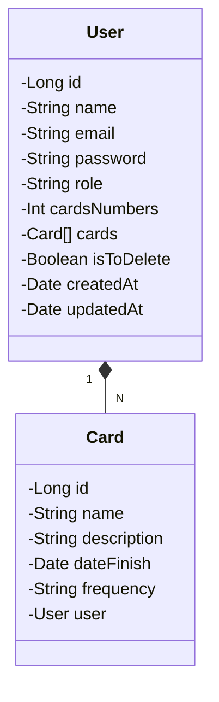

## API cujo objetivo é disponibilizar end points para um front-end feito em angular.**[Link front-end](https://github.com/MarcosViniSil/Cadastrou-FrontEnd)**
## Tecnologias utilizadas
- Spring Boot
- Spring Security (JWT + criptografia)
- Kotlin
- H2 database
- MySql
- Railway
- PostMan
- JUnit
## Contextualização
### A API desenvolvida tem como objetivo possibilitar o cadastro e login de usuários. Além disso, permite que os usuários cadastrem `cards` associados a qualquer contexto, oferecendo a flexibilidade de cadastrar informações variadas. A API também gerencia o uso de e-mails, automatizando notificações para informar os usuários sobre cadastros e validações de dados.
## Diagrama de classes

## Uso de Token
### Quando o usuário realiza o login um token JWT é gerado, contendo informações necessárias para autenticação e autorização do usuário para realizar operações na api. Também há criptografia de dados sensíveis no banco de dados.

  
  | Requisição  | Url         | Resposta   |
  |-------------|-------------|-------------|
  | POST        | /User/Login | eyJhbGciOiJIUzI1N +...+ LhI-BhPdU  |
  

